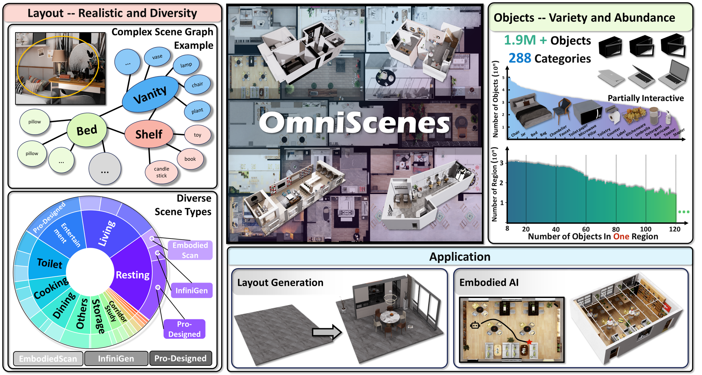

 

<h1 align="center">OmniScenes: A Large-scale Simulatable Indoor Scene Dataset with Realistic Layouts</strong></h1>

## 🏡 About
<!--  -->

    

  We introduce <b>OmniScenes, a novel large-scale simulatable indoor scene dataset</b> comprising approximately <b>40,000 diverse scenes</b> by integrating three disparate scene sources, \ie, real-world scans, procedurally generated scenes, and designer-created scenes, including <b>1.96M objects and 800k CAD models</b> that cover <b>15 common scene types and 288 object classes</b>, resulting in complex layouts that have <b>most-ever 41.5 objects per region in average</b>.
